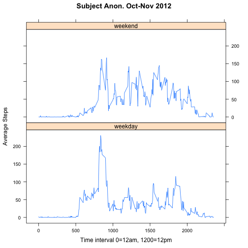
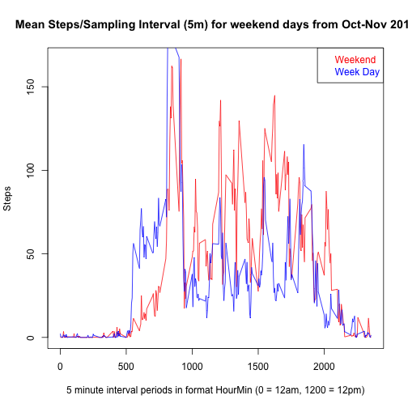

# Reproducible Research: Peer Assessment 1
Coursera.com JHU Reproducible Research Peer Assessment 1 Project.
Submitted by Leif Ulstrup.  June 12, 2014.


## Loading and preprocessing the data
Note: This code assumes that the activity.zip data file is in the current working directory.  If not, use setwd() to change the directory to the correct location.

Unzip the compressed activity log file...

```r
zipfile <- "activity.zip"
fileThere <- (zipfile %in% dir())
if(!fileThere){stop("Error:  activity.zip missing from directory")}
unzip(zipfile)
```

Read the activity.csv file into memory...

```r
activity <- read.csv("activity.csv")
```

Convert dates into date format for calculation purposes...

```r
activity$date <- as.Date(activity$date)
```

Compute the total steps per day...

```r
dailySteps <- tapply(activity$steps, activity$date, FUN=sum)
```

## Create a histogram of the total number of steps taken each day


```r
hist(dailySteps, breaks = c(0,2500,5000,7500, 10000,12500,15000,17500,20000, 22500, 25000), main = paste("Subject Anonymous Activity (Steps) from Oct-Nov 2012"), xlab = "Steps/Day", ylab = "Number of Days" , ylim = c(0,30))
```

 


## What is the mean (average) total number of steps taken per day?


```r
theSummary <- summary(dailySteps, na.rm=TRUE)
print(theSummary)
```

```
##    Min. 1st Qu.  Median    Mean 3rd Qu.    Max.    NA's 
##      41    8840   10800   10800   13300   21200       8
```

```r
theMean <- as.numeric(theSummary["Mean"])
textMean <- paste("The Mean Number of Steps/Day :", theMean)
print(theMean)
```

```
## [1] 10800
```

```r
print(textMean)
```

```
## [1] "The Mean Number of Steps/Day : 10800"
```

```r
theMedian <- as.numeric(theSummary["Median"])
textMedian <- paste("The Median Number of Steps/Day :", theMedian)
print(theMedian)
```

```
## [1] 10800
```

```r
print(textMedian)
```

```
## [1] "The Median Number of Steps/Day : 10800"
```

## What is the average daily activity pattern?

With 5 minute sampling periods there are 12/hour * 24 hours = 288 sample periods/day (0,5,10,15,...)


```r
require(data.table)
```

```
## Loading required package: data.table
```

```r
intervalsteps <- data.frame(interval = activity$interval, steps = activity$steps)
intervalstepsdt <- data.table(intervalsteps)
dtinterval <- intervalstepsdt[, mean(steps, na.rm= TRUE), by = interval]
setnames(dtinterval, "V1", "averageSteps")
plot(dtinterval$interval, dtinterval$averageSteps, type="l", main="Mean Steps/Sampling Interval (5m) for all days from Oct-Nov 2012", xlab = "5 minute interval periods in format HourMin (0 = 12am, 1200 = 12pm)", ylab = "Steps")
```

 

```r
maxsteps <- dtinterval[dtinterval$averageSteps == max(dtinterval$averageSteps, na.rm=TRUE)]
print(maxsteps)
```

```
##    interval averageSteps
## 1:      835        206.2
```

### Time interval 835 has the maximum average steps per time period with 206 average steps.


```r
plot(activity$interval, activity$steps, main="All Steps/Sampling Interval (5m) for all days from Oct-Nov 2012", xlab = "5 minute interval periods in format HourMin (0 = 12am, 1200 = 12pm)", ylab = "Steps")
```

 

## Imputing missing values


```r
ok <- complete.cases(activity)
countNAs <- sum(!ok)
totalrows <- nrow(activity)
```

There are 2304 samples missing data from a total of 17568 rows in the activity log data. 

To populate the data that is missing and impute values, I will use the average values for that same time interval from the earlier analysis above where we computed the average steps per time period.


```r
imputeFcn <- function(x){
  print(names(x))
  if(x$steps == NA) {
    getSteps <- dtinterval[dtinterval$interval == x$interval,]$averageSteps
    x$steps <- getSteps}
  theResult <- x
  return(theResult)
}

# create a new data set and replace NA values with the time interval averages computed earlier with dtinterval
xactivity <- activity
# resorted to inefficient for loop to do look up replacements - could not find suitable vector operation - need more research on this - ok for homework assignment but...
for(i in 1:nrow(xactivity)){
  if(is.na(xactivity[i,1])){
    xactivity[i,1] <- dtinterval[dtinterval$interval == xactivity[i,3],]$averageSteps
  }
}

summary(xactivity)
```

```
##      steps            date               interval   
##  Min.   :  0.0   Min.   :2012-10-01   Min.   :   0  
##  1st Qu.:  0.0   1st Qu.:2012-10-16   1st Qu.: 589  
##  Median :  0.0   Median :2012-10-31   Median :1178  
##  Mean   : 37.4   Mean   :2012-10-31   Mean   :1178  
##  3rd Qu.: 27.0   3rd Qu.:2012-11-15   3rd Qu.:1766  
##  Max.   :806.0   Max.   :2012-11-30   Max.   :2355
```

```r
summary(activity)
```

```
##      steps            date               interval   
##  Min.   :  0.0   Min.   :2012-10-01   Min.   :   0  
##  1st Qu.:  0.0   1st Qu.:2012-10-16   1st Qu.: 589  
##  Median :  0.0   Median :2012-10-31   Median :1178  
##  Mean   : 37.4   Mean   :2012-10-31   Mean   :1178  
##  3rd Qu.: 12.0   3rd Qu.:2012-11-15   3rd Qu.:1766  
##  Max.   :806.0   Max.   :2012-11-30   Max.   :2355  
##  NA's   :2304
```

Compute the total steps per day after replacing NAs with time period averages...

```r
xdailySteps <- tapply(xactivity$steps, xactivity$date, FUN=sum)
```

Create a histogram of the total number of steps taken each day


```r
par(mfrow=c(1,2), mar=c(5.1, 4.1, 5.6, 2.1))
hist(xdailySteps, breaks = c(0,2500,5000,7500, 10000,12500,15000,17500,20000, 22500, 25000), main = paste("Subject Anonymous\n Activity (Steps)\n from Oct-Nov 2012\n NAs Replaced with \n Average Time Period Values"), xlab = "Steps/Day", ylab = "Number of Days" , ylim = c(0,30))

hist(dailySteps, breaks = c(0,2500,5000,7500, 10000,12500,15000,17500,20000, 22500, 25000), main = paste("Subject Anonymous\n Activity (Steps)\n from Oct-Nov 2012\n Original Data with NAs"), xlab = "Steps/Day", ylab = "Number of Days" , ylim = c(0,30))
```

 

```r
xtheSummary <- summary(xdailySteps, na.rm=TRUE)
print(xtheSummary)
```

```
##    Min. 1st Qu.  Median    Mean 3rd Qu.    Max. 
##      41    9820   10800   10800   12800   21200
```

```r
xtheMean <- as.numeric(xtheSummary["Mean"])
textMean <- paste("The Mean Number of Steps/Day :", xtheMean)
print(theMean)
```

```
## [1] 10800
```

```r
print(textMean)
```

```
## [1] "The Mean Number of Steps/Day : 10800"
```

```r
xtheMedian <- as.numeric(theSummary["Median"])
textMedian <- paste("The Median Number of Steps/Day :", xtheMedian)
print(theMedian)
```

```
## [1] 10800
```

```r
print(textMedian)
```

```
## [1] "The Median Number of Steps/Day : 10800"
```

### The Mean and Median remained the same after using this replacement technique for NAs; however, the plots show the increased magnitude of the histogram frequency results with even more emphasis on the peak of the overall daily distribution mean.


## Are there differences in activity patterns between weekdays and weekends?


```r
xactivity$weekday <- weekdays(xactivity$date)  #adds a factor column for the day of the week
xactivity$daytype <- ifelse(xactivity$weekday %in% c("Saturday","Sunday"), "weekend", "weekday")


xintervalsteps <- data.frame(interval = xactivity$interval, steps = xactivity$steps, daytype = xactivity$daytype)
xintervalstepsdt <- data.table(xintervalsteps)

weekend <- xintervalstepsdt[xintervalstepsdt$daytype == "weekend", ]
weekday <- xintervalstepsdt[xintervalstepsdt$daytype == "weekday", ]

weekendinterval <- weekend[, mean(steps, na.rm= TRUE), by = interval]
weekdayinterval <- weekday[, mean(steps, na.rm= TRUE), by = interval]
setnames(weekendinterval, "V1", "averageSteps")
setnames(weekdayinterval, "V1", "averageSteps")
weekendinterval$daytype <- "weekend"
weekdayinterval$daytype <- "weekday"

alldays <- rbind(weekdayinterval, weekendinterval)

#Panel plot using Lattice system
require(lattice)
```

```
## Loading required package: lattice
```

```r
xyplot(alldays$averageSteps ~ alldays$interval | alldays$daytype, type = "l", main="Subject Anon. Oct-Nov 2012", xlab="Time interval 0=12am, 1200=12pm", ylab = "Average Steps", layout = c(1,2))
```

 

```r
# final extra plot to see an overlay of activity between weekend and weekday.

plot(weekendinterval$interval, weekendinterval$averageSteps, type="l", main="Mean Steps/Sampling Interval (5m) for weekend days from Oct-Nov 2012", xlab = "5 minute interval periods in format HourMin (0 = 12am, 1200 = 12pm)", ylab = "Steps", col="red")

points(weekdayinterval$interval, weekdayinterval$averageSteps, type="l", col="blue")
legend("topright", c("Weekend", "Week Day"), text.col=c("red", "blue"))
```

 

### The last plot shows that the subject became active later in the morning on weekends and was more active during the day on the weekends.  Observations consistent with expectations.

